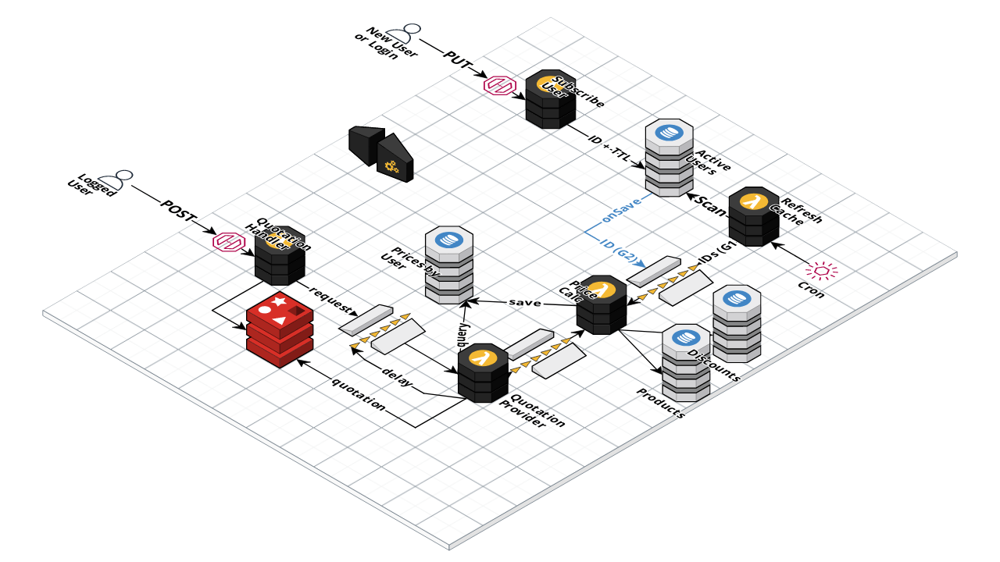

# Organic Cache
Proof of Concept for a organic cache in AWS, offering a price quotation API that responds immediately when the price table is already available, and if not calculates on demand and saves the user ID to periodically recalculate and allows to be available on time.
If the user stops to consume the API after a pre determined time, that price table stops to be recalculated periodically, saving processing time.

## Solution Diagram

[Source](https://app.cloudcraft.co/view/c11241e7-f79b-42b3-b008-85ca557f501c?key=5618624e-2104-4aec-8a13-c1d94a20a96c)


## Scenarions
### User Subscription
1. On user first access, on calling ***Subscribe User PUT***, it's unique ID is registred on DynamoDB **Active Users** to be recalculated regurlaly, and a TTL (time-to-live) attribute.
1. If the result record stills un-updated until the TTL expires, it's automaticaly removed by DynamoDB and user price table will no longer be recalculated regurlaly.
1. If the same user is subscribed again, the TTL is updated with the new expiration time.

### Price Table
1. A scheduled CloudWatch Event Rule triggers the Lambda **Refresh Cache**, scans all items in DynamoDB **Active Users**, and for each of them generates a message to SQS **Refresh Queue**.
1. For each message on SQS **Refresh Queue**, Lambda **Price Calc** scan for all DynamoDB **Products** and query for user's DynamoDB **Discounts´**, calculating user's price table (with original and final prices) and saving into DybanoDB **Prices by User**. 

### Quotation Available
1. To request a quotation, the user can call the ***Quotation POST***, sending his ID and a list of products IDs and quantities. 
1. The Lambda **Quotation Handler** sends a message to SQS **Quotation Queue** with the quotation data, and waits for a available response in Elasticache (for education purposes, I used Hazelcast instead, because of it's cabapility of working together with localstack in docker-compose, and it's funcionality of topic Pub/Sub) 
1. The Lambda **Quotation Provider** queries for the corresponding prices table from the receiving user's ID. Using the user's price table and products final prices and expected quantities, generates the quotation and put into Elasticache.
1. Lambda **Quotation Handler** that's waiting for the response, receives the quotation and returns to the user.

### Quotation Unavailable
1. To request a quotation, the user can call the ***Quotation POST***, sending his ID and a list of products IDs and quantities. 
1. The Lambda **Quotation Handler** sends a message to SQS **Quotation Queue** with the quotation data, and waits for a available response in Elasticache (for education purposes, I used Hazelcast instead, because of it's cabapility of working together with localstack in docker-compose, and it's funcionality of topic Pub/Sub) 
1. The Lambda **Quotation Provider** queries for the corresponding prices table from the receiving user's ID. If it's not available, sends a message to the SQS **Recalculation Queue**, to be processed ASAP by the Lambda **Price Calc**, and put back the message on SQS **Quotation Queue** to be processed later.
1. Next time the Lambda **Quotation Provider** receives the message, it queries for the corresponding prices table from the receiving user's ID. If it's not available, put back again the message on SQS **Quotation Queue**, but limited to 10 retries.
1. If the price table is somewhen available, it's returned (as explained before) to the user. If not, Lambda **Quotation Handler** after 10s stop waiting and returns an HTTP 408 Timeout. 


## Local setup
### Installed programs:
- Docker
- Docker Compose
- Go
- Terraform
- Terraform Local
- AWS CLI


### Usage
I recommend multiple terminals (like Ubuntu Terminator) to keep track of all running events

#### Terminal 1 - docker-compose
```
$ cd localstack
$ docker-compose up
```

#### Terminal 2 - terraform
```
$ make package 
$ tflocal init
$ tflocal apply --auto-approve
```
Keep this terminal on sight, copy the output ***url_quotation*** value to be used a few moments later... 

And load the prices and user discounts into DynamoDB:

```
$ make load
```

#### Terminal 3 - user subscribe
```
$ make subscribe ID=AAA
```
Now eyes on Terminal 1.... A few moments later Lambda **Refresh Cache** will be triggered and you be able to notice the user AAA price table be calculated.

#### Browser - Quotation

Open the file [](doc/index.html), open DevTools (F12) and switch to Console view.

Click on Setup and paste the ***url_quotation*** value into input box, and Click on Close. You should see a message "*opened*" on console view.

Sometimes after 60s you will see also a "pong!" message there... Don't mind, it's the javascript making the websocket active :smile:

On *Client ID* input, you can use any string (like Foo) and on console you will receive a first message "quotation under analisys", and right after another response with 3 products.

If you use AAA or BBB as *Client ID*, some products will be answered with a discount, present in [](dynamodb_user_discounts.json). You can modify to test different results, loading the data on Terminal 2 again.


#### TIP
You can monitor a lambda individually by connecting into the corresponding docker process:
```
docker logs --follow $(docker ps -f name=price-calc -q)
```

## Conclusion
This project is for educational purpuse only, used to learn more about AWS and GoLang features (like parallel programming and circuit breaker strategy).